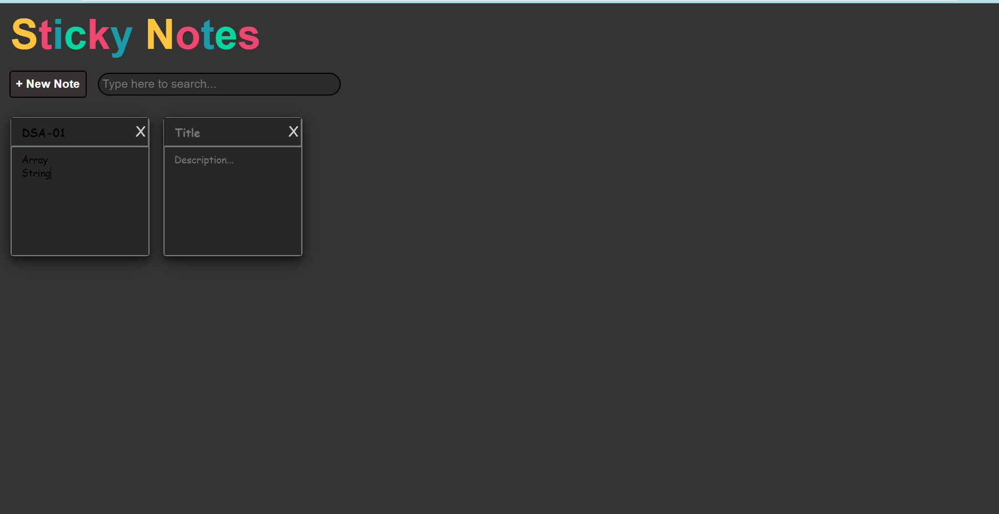

# STICKY NOTES :writing_hand:



The Sticky Notes is as the name suggests, ReactJs application you can use to create
sticky notes. The sticky notes are persistent in nature meaning your created sticky
notes will be there the next time you open up the app. In short, it is sticky notes for web !

## FEATURES :technologist:

 - Add text and lists
 - Search column to find specific notes
 - Customize Width and Height
 - Responsive WebApp
 - Real sticky notes look
 - Nice hand-writing-like font

# Sticky Notes

The Sticky Notes project is a web-based application that allows users to create, edit, and delete sticky notes for organizing their tasks and thoughts. This project is built using HTML, CSS, JavaScript, and React.

## Table of Contents

- [Features](#features)
- [Technologies Used](#technologies-used)
- [Installation](#installation)
- [Usage](#usage)
- [Contributing](#contributing)
- [License](#license)

## Features

- Create new sticky notes with custom content.
- Edit existing sticky notes.
- Delete sticky notes.
- Responsive design for mobile and desktop use.
- Save notes to local storage to persist them across sessions.

## Technologies Used

- HTML5
- CSS3
- JavaScript (ES6+)
- React

## Installation

To run this project locally, follow these steps:

1. Clone the repository:

    ```bash
    git clone https://github.com/yourusername/sticky_notes.git
    ```

2. Navigate to the project directory:

    ```bash
    cd sticky_notes
    ```

3. Install the dependencies:

    ```bash
    npm install
    ```

4. Start the development server:

    ```bash
    npm start
    ```

5. Open your web browser and go to `http://localhost:3000`.

## Usage

1. Open the application in your web browser.
2. Use the input field to create a new sticky note.
3. Click on a note to edit its content.
4. Use the delete button to remove a note.
5. The notes will be saved to local storage and persist across sessions.

## Contributing

Contributions are welcome! If you would like to contribute to this project, please follow these steps:

1. Fork the repository.
2. Create a new branch for your feature or bugfix:

    ```bash
    git checkout -b feature/your-feature-name
    ```

3. Commit your changes:

    ```bash
    git commit -m 'Add some feature'
    ```

4. Push to the branch:

    ```bash
    git push origin feature/your-feature-name
    ```

5. Open a pull request on GitHub.

## License

This project is licensed under the MIT License. See the [LICENSE](LICENSE) file for details.
